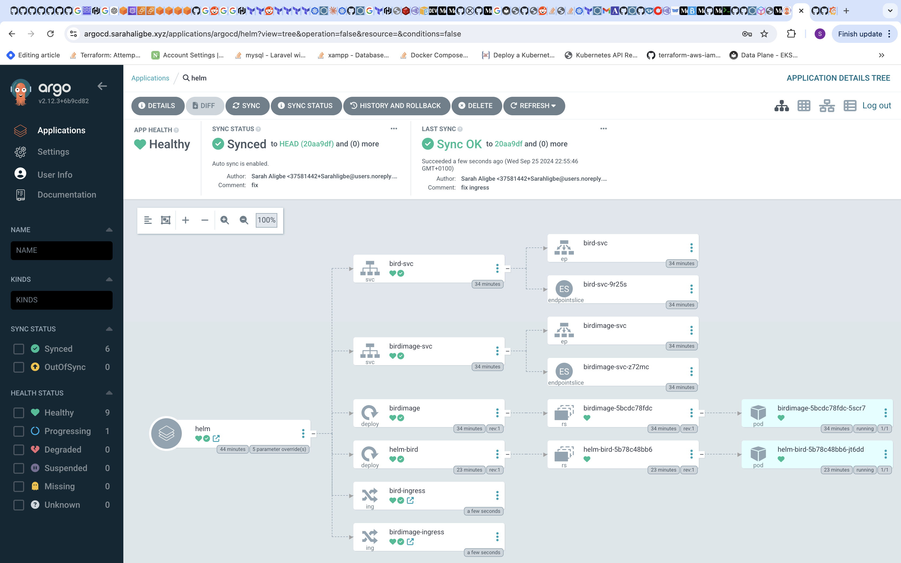
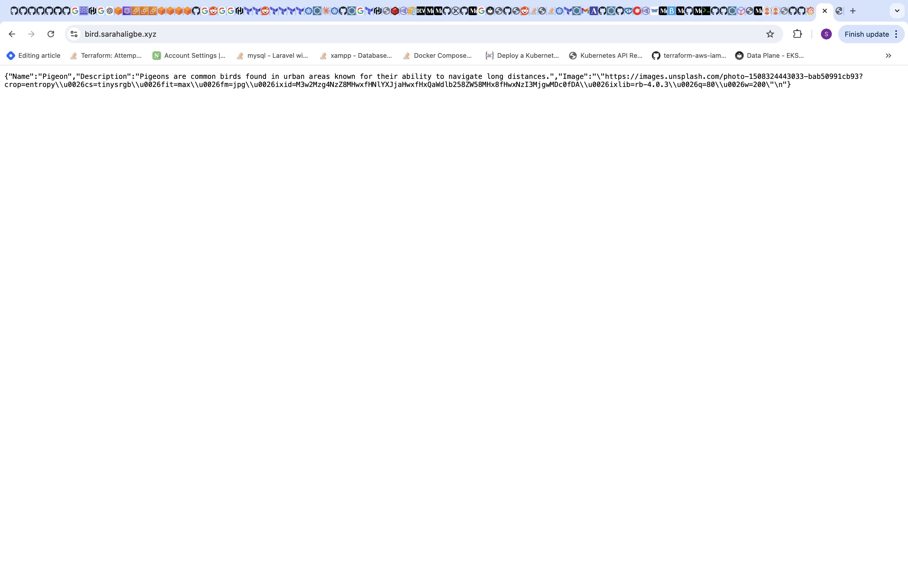
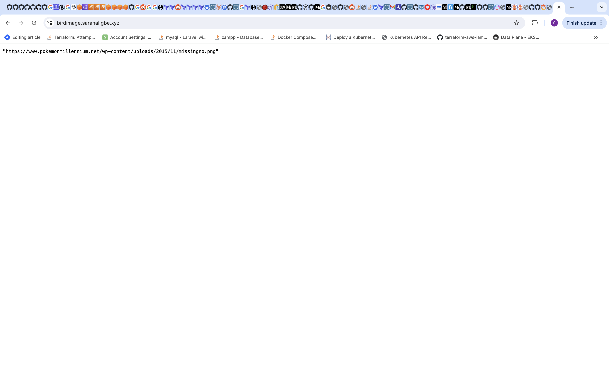
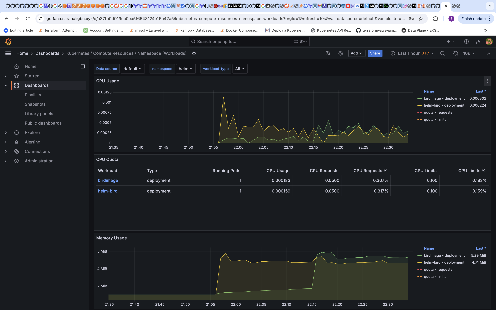

# Bird Application

This is the bird Application! It gives us birds!!!

The app is written in Golang and contains 2 APIs:
- the bird API
- the birdImage API

When you run the application (figure it out), you will see the relationship between those 2 APIs.

# installation & how to run it

Find it

# Challenge

How to:
- fork the repository
- work on the challenges
- share your repository link with the recruitment team

Here are the challenges:
- Install and run the app
- Dockerize it (create dockerfile for each API)
- Create an infra on AWS (VPC, SG, instances) using IaC
- Install a small version of kubernetes on the instances (no EKS)
- Build the manifests to run the 2 APIs on k8s 
- Bonus points: observability, helm, scaling

Rules:
- Use security / container / k8s / cloud best practices
- Change in the source code is possible

Evaluation criterias:
- best practices
- code organization
- clarity & readability

# Solution

This document outlines the setup of a Kubeadm Kubernetes cluster on AWS using Terraform. The infrastructure is designed with security and scalability in mind, leveraging various AWS services and Kubernetes add-ons.

## Running the app locally
1. Ensure you have go installed
2. cd into the birdImage/ directory and run `go build -o getBirdImage`
3. Run ./getBirdImage to start the app
4. Repeat the same steps for the bird/ directory
5. Ensure you have ports `4200` and `4201` opened in your instance security groups.

## Dockerizing each API
The Dockerfile uses a multi-stage build process, which helps create a smaller and more secure final image. It consists of two stages:

1. Build stage
2. Final stage

### Best Practices Implemented

1. Multi-stage Build: Reduces final image size by excluding build tools and intermediate files.
2. Minimal Base Image: Uses Alpine Linux, known for its small size and security benefits.
3. Non-root User: Creates and uses a non-root user for running the application, enhancing security.
4. Dependency Caching: Copies and downloads dependencies before copying the source code, leveraging Docker's layer caching.
5. Single Concern: The final image contains only what's necessary to run the application.

### Security Considerations

1. The application runs as a non-root user, reducing potential vulnerabilities.
2. Only the compiled binary is present in the final image, minimizing the attack surface.
3. Using official and version-specific base images helps in tracking and updating for security patches.

- cd into the bird and birdImage directories respectively and run `docker build -t <image_name>:<tag> .` to build the image
- Run `docker run -d -p 4201:4201 <image_name>:<tag>` to run the containers

## Infrastructure Components

### Pre-requisites
1. Terraform installed
2. An existing domain name on Route53
3. An existing SSH key to create the instances (in the event you'll like to ssh into the instance using the ec2 instance connect id)
4. An IAM role on AWS with elevated privileges

### 1. Networking (VPC)

- Created a dedicated VPC for the Kubernetes cluster
- Set up both public and private subnets across multiple Availability Zones
- Implemented an Internet Gateway for public subnets
- Added a NAT Gateway to allow outbound internet access from private subnets
- Configured route tables for proper traffic flow

### 2. Security Groups

- Created separate security groups for control plane and worker nodes
- Set up an EC2 Instance Connect Endpoint for secure SSH access to instances in private subnets

### 3. IAM and IRSA (IAM Roles for Service Accounts)

- Set up IAM roles for EC2 instances (control plane and worker nodes) to get and put parameters with SSM
- Implemented IRSA for pod-level AWS permissions:
  - Created an S3 bucket for OIDC discovery
  - Generated and stored IRSA keys securely in SSM Parameter Store
  - Set up an IAM OIDC provider

### 4. EC2 Instances

- Launched EC2 instances for control plane and worker nodes in private subnets
- Implemented user data scripts for automatic Kubernetes setup on instance launch

### 5. Kubernetes Setup

- Used kubeadm for cluster initialization
- Cert-Manager: For automated certificate management for the pod identity webhook
- Configured the cluster with AWS pod identity webhook to enable IRSA in self-managed clusters
- Set up Calico as the Container Network Interface (CNI)

### 6. Cluster Add-ons

- AWS Load Balancer Controller: For managing AWS load balancers
- External DNS: For automatic DNS record management
- ArgoCD: For GitOps-style deployments
- Prometheus and Grafana: For monitoring and observability

## Key Security Measures

1. Network Isolation: All Kubernetes nodes are in private subnets
2. IAM Roles: Used for EC2 instances instead of static credentials
3. IRSA: Implemented for fine-grained AWS permissions for pods and principle of least privilege
4. Security Groups: Tightly controlled inbound and outbound traffic
5. EC2 Instance Connect: Secure method to SSH into instances without public IPs

## Deployment Process

1. Terraform is used to create the AWS infrastructure
2. EC2 user data scripts automatically set up Kubernetes on instance launch
3. Control plane initialization creates the cluster and stores join command in SSM
4. Worker nodes retrieve the join command from SSM and join the cluster
5. Add-ons are installed automatically post-cluster formation

## Accessing the Cluster

- The kubeconfig file is stored in SSM Parameter Store and can be retrieved for cluster access
- ArgoCD is set up for deploying applications to the cluster. Run this command to get your initial ArgoCD password
```bash
   kubectl -n argocd get secret argocd-initial-admin-secret -o jsonpath="{.data.password}" | base64 -d
```

## Monitoring and Logging

- Prometheus is installed for metrics collection
- Grafana dashboards are available for visualization

## Helm
The Helm chart for the Bird application uses an umbrella chart structure with two subcharts, 'bird' and 'birdimage', allowing for modular deployment and configuration of different components of the application.

### Best Practices Implemented

1. Modular Structure: Separates concerns into subcharts for easier management
2. Conditional Deployment: Allows enabling/disabling components as needed
3. Shared Templates: Uses _helpers.tpl for common definitions, promoting DRY principles
4. Customizable: Extensive use of .Values for configuration
5. Edited the source code to use environment variables to call local services

 




### Usage
1. Run
```bash
   helm dependency update
```
2. Run
```bash
   helm install bird-app ./helm
```

The helm chart is deployed using ArgoCD removing the need for running the above command.
